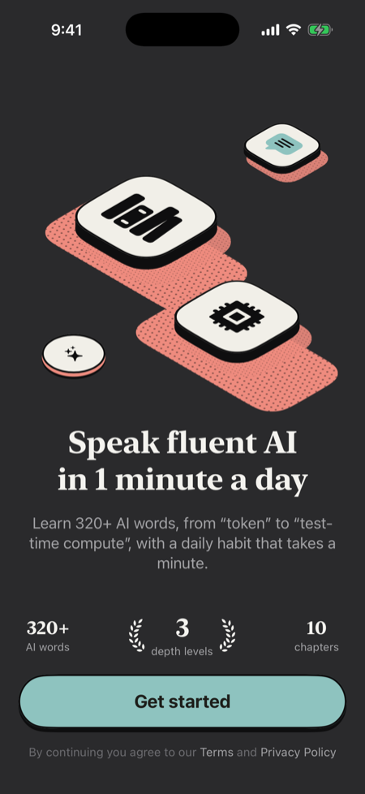
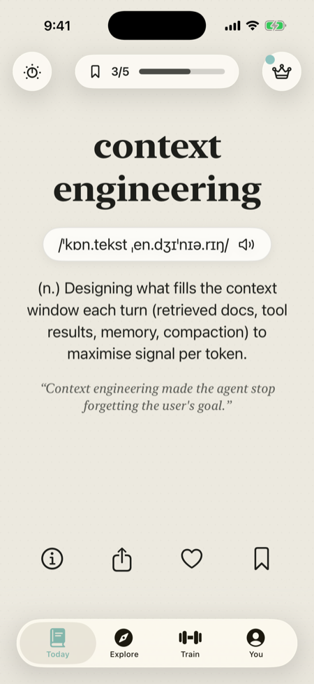
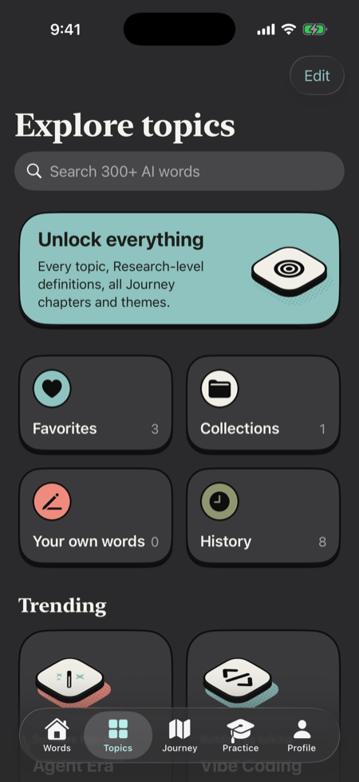
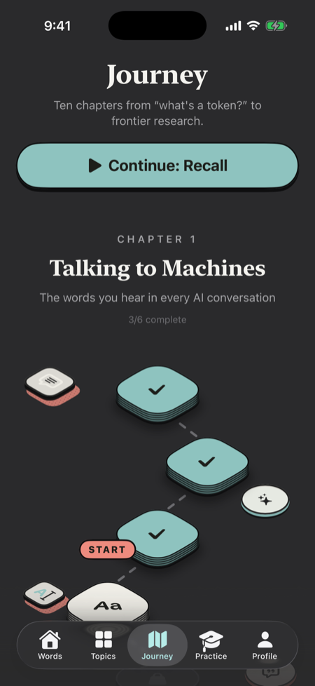
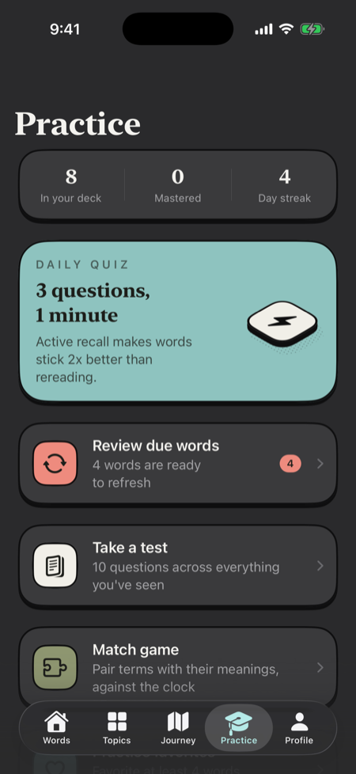

# AI-Cab

Learn the language of AI in one minute a day. A native SwiftUI iOS app with a swipeable word feed, three definition depths, a chapter-based Journey, spaced-repetition practice, Home and Lock Screen widgets, reminders, and a weekly content pipeline.

<p>
    
</p>

Screenshots are captured automatically by CI (`ios/scripts/screenshots.sh`) on every push.

## What's inside

| Path | What it is |
|---|---|
| `ios/Packages/AICabCore` | Swift package. **AICabCore** holds the domain layer (models, feed/SRS/streak/journey/quiz/notification/nudge engines, persistence, widget data exchange) and is Foundation-only and unit-tested. **AICabDesign** holds the SwiftUI design system (tokens, Liquid Glass and tactile components, illustrations). |
| `ios/AICab` | The app: `App/` (composition root, routing), `Services/` (StoreKit 2, notifications, speech, widget sync), `Features/` (one folder per screen). |
| `ios/AICabWidgets` | WidgetKit extension: word widget (small/medium/large and Lock Screen inline/rectangular/circular, with interactive Save/Next) and a streak widget. |
| `content/` | Source of truth for the catalog: `topics.yaml`, `chapters.yaml`, `terms/*.yaml` (320 terms). |
| `pipeline/` | `build_content.py` validates and compiles content. `discover.py` and `generate.py` find and draft new terms with Claude. |
| `server/define-worker` | Optional Cloudflare Worker behind the "Draft with AI" button in *Your own words*. |
| `site/` | Landing and privacy pages, served with the content pack on GitHub Pages. |
| `docs/PLAN.md` | Product plan and design breakdown. |

## Run it

Requirements: Xcode 26+ and [XcodeGen](https://github.com/yonaskolb/XcodeGen).

```bash
brew install xcodegen
cd ios && xcodegen generate && open AICab.xcodeproj
```

1. Select the **AICab** scheme and an iPhone simulator, then Run. The scheme uses `AICab.storekit`, so purchases work locally without App Store Connect.
2. To run on a device, set your team in `project.yml` (`DEVELOPMENT_TEAM`), or under Signing & Capabilities for both targets. Then register the App Group `group.com.aicab.app`, which the app and widgets share.

Core tests run without Xcode projects:

```bash
swift test --package-path ios/Packages/AICabCore
```

## Content

```bash
pip install pyyaml
python3 pipeline/build_content.py          # validate + write ios/AICab/Resources/content.json and dist/content/
python3 pipeline/build_content.py --check  # validate only (CI)
```

You never need to quote values in term files. Each term needs `id`, `term`, `difficulty`, `topics` and `beginner`/`builder`/`research` definitions. Analogy, example (containing the term), origin, related and contrast are optional but improve quizzes. Bump `content/config.yaml` → `version` to ship an update to installed apps.

**Shipping updates without App Store review:** the *Publish content* workflow builds the pack and deploys it to GitHub Pages. To turn it on, go to Settings → Pages → Source and choose "GitHub Actions". The app polls `AICabContentManifestURL` (in `project.yml`) on launch and caches newer packs.

**Weekly new terms:** the *Weekly new terms* workflow scans arXiv, Hugging Face Papers and Hacker News, asks Claude to draft entries in the house style, and opens a PR for human review. Add the `ANTHROPIC_API_KEY` repository secret to enable it. You can also run it by hand with a list of terms.

## Configuration (`ios/project.yml` → Info.plist)

| Key | Purpose |
|---|---|
| `AICabContentManifestURL` | Where content updates are fetched from. Leave empty for bundled content only. |
| `AICabDefineURL` | URL of the deployed `server/define-worker`. The "Draft with AI" button only appears when this is set. |
| `AICabFacebookAppID` | Required by Instagram Stories sharing. The Stories button only appears when this is set. |
| `AICabAppStoreID` | Enables the "Share AI-Cab" row. |
| `AICabSupportEmail`, `AICabPrivacyURL`, `AICabTermsURL` | Feedback and legal links. |

Product IDs (App Store Connect): `com.aicab.pro.yearly` (3-day free trial), `com.aicab.pro.monthly`, `com.aicab.pro.lifetime`.

## Architecture notes

- **Single source of truth:** `AppModel` (`@Observable`, `@MainActor`) owns state. Views call intent methods, and every write goes through `mutate(_:)`, which persists with a debounce. Services sit behind protocols (`NotificationScheduling`, `WidgetSyncing`, `RemoteContentFetching`, `DefinitionDrafting`, `UserStateStoring`) and are injected in `AppModel.live()`.
- **Offline-first:** the full catalog ships in the app. Remote packs only ever replace it with a newer version.
- **Widgets never hit the network.** The app writes a small snapshot to the App Group. Widget buttons append to an inbox file that the app merges on the next launch, so the two processes never write the same file.
- **Nudges are rule-based** (`NudgeEngine`): one at a time, each with a cooldown. They cover the widget install guide, the review pre-prompt (only right after hitting the daily goal), the Journey intro and the soft paywall. Local notifications cover word reminders, an evening streak saver, a come-back nudge and a trial-ending reminder.
- **Liquid Glass:** iOS 26 gets the system glass tab bar (it minimises on scroll) and `glassEffect` controls. iOS 18 falls back to materials.
